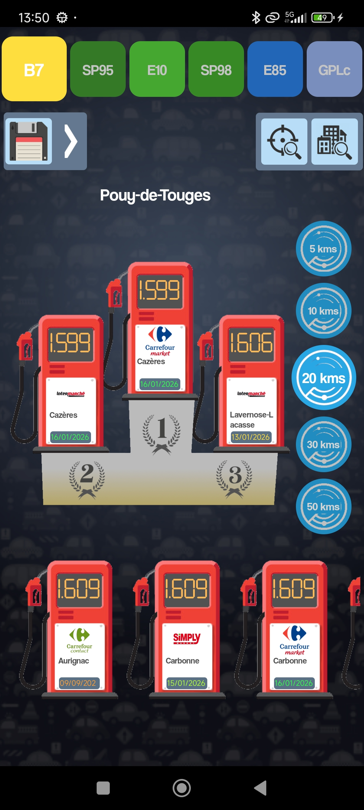

# ⛽ Cheap Fuel - Fuel Price Finder

> React Native mobile app for finding the best fuel prices near you

**Published on Google Play Store: February 2023 - December 2024**

## 🎥 Demo

**Watch the 2-minute demo:** [YouTube Link](https://youtube.com/...](https://youtube.com/shorts/4JX5yq3kY4w?feature=share)

## 📸 Screenshots

<table>
  <tr>
    <td></td>
    <td></td>
  </tr>
</table>

## ✨ Features

- 🗺️ Real-time geolocation
- 📍 Interactive map with fuel stations
- 💰 Live fuel prices (French government open data API)
- 🔍 Filter by fuel type (Diesel, SP95, SP98, E10)
- 📊 Distance sorting
- 📱 Native Android experience

## 🛠️ Tech Stack

- **Frontend:** React Native + Expo
- **APIs:** Geolocation API, French Government Fuel Price API
- **Monetization:** AdMob
- **Storage:** AsyncStorage

## 📝 Deployment History

**Google Play Store (Feb 2023 - Dec 2024)**
- Published and maintained for 2 years
- 5+ downloads 😂🤣
- 4.2★ average rating
- Developer account closed due to maintenance costs

## 💡 Key Technical Challenges Solved

- Public API integration and data parsing
- Geolocation permissions (foreground & background)
- Google Play Store deployment
- App monetization with AdMob integration

---

*This app was actively maintained and available on Google Play Store for 2 years before account closure.*
